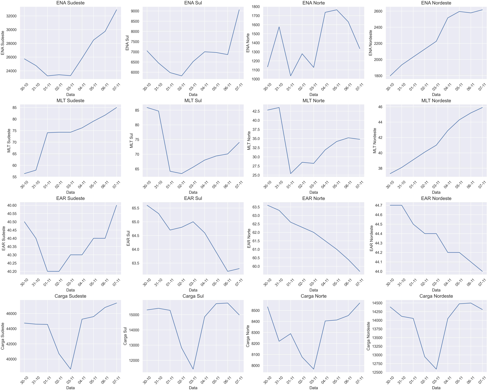

# Automação de Download e Análise de IPDO's do Portal SINtegre  

Este projeto automatiza o download e a análise dos **Informativos Preliminares de Operação (IPDO)** publicados diariamente no portal **SINtegre** do **Operador Nacional do Sistema Elétrico (ONS)**.  

Os IPDOs fornecem informações detalhadas sobre a operação do **Sistema Interligado Nacional (SIN)**, incluindo dados fundamentais para o acompanhamento do preço da energia elétrica, como:  
- **ENA**: Energia Natural Afluente,  
- **MLT**: Média de Longo Termo,  
- **EAR**: Energia Armazenada em Reservatórios,  
- **Carga**: Demanda elétrica.  

Este projeto utiliza as bibliotecas **Selenium** e **Webdriver** para acessar o portal SINtegre, baixar os arquivos IPDO editáveis, e gerar tabelas e gráficos com os dados analisados.  

---

## Funcionalidades  

1. **Automação de Login no Portal SINtegre**  
   - O código faz login automaticamente no portal usando as credenciais fornecidas.  

2. **Download Automático de IPDOs**  
   - Faz o download de todos os IPDOs editáveis disponíveis no portal que ainda não estão armazenados na pasta `ipdo` do projeto.  

3. **Análise de Dados**  
   - Lê os arquivos IPDO baixados e extrai informações das grandezas **ENA**, **MLT**, **EAR**, e **Carga**.  
   - Atualiza automaticamente uma tabela no arquivo **Preenchimento IPDO.xlsx** com os dados extraídos.  

4. **Geração de Gráficos**  
   - Cria gráficos para cada uma das grandezas analisadas e os salva na pasta `Gráficos` dentro do diretório do projeto.  
   
   

## Configuração
Para o correto funcionamento do código, é necessário entrar com as seguintes informações no arquivo config.txt:
- **Usuário SINtegre**
- **Senha SINtegre**
- **Data de início**

Uma alternativa para execução do código é apenas abrir o arquivo ipdo_exe.bat, com as devidas autorizações do sistema operacional